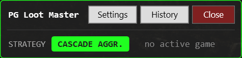
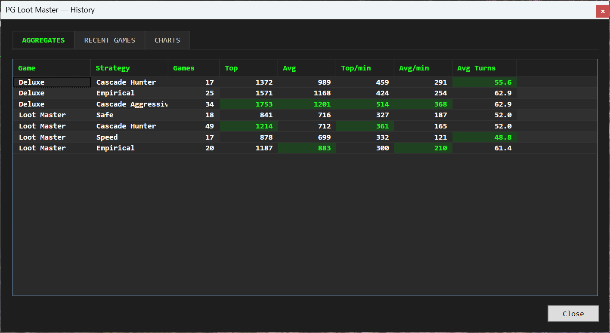
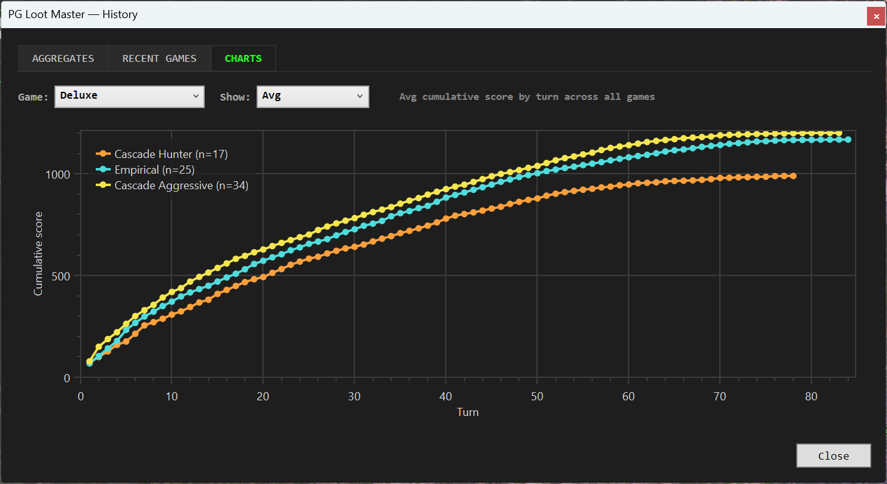

# PG Loot Master

A Windows overlay that watches Project: Gorgon's **match-3 minigames** and tells you which tiles to swap. Picks moves with a cascade-aware solver, tracks your scores per strategy, and shows how each game stacks up against your historical best.

Works with all three match-3 vendors:
- **Loot Master**
- **Cashfall**
- **Lootmaster Deluxe**

---

## Install

1. Grab the latest **`PgLootMaster-windows.zip`** from [Releases](https://github.com/suceava/pg-loot-master/releases).
2. Unzip anywhere. You'll get `PgLootMaster.exe` and a `Templates\` folder next to it — **keep them together**.
3. Run Project: Gorgon in **borderless windowed** mode. Exclusive fullscreen blocks the tool from seeing the screen.
4. Double-click `PgLootMaster.exe`.
   - First launch shows a SmartScreen warning ("Windows protected your PC") because the exe isn't code-signed. Click **More info** → **Run anyway**. One-time.

### Requirements

- **Windows 10 2004 (May 2020 update) or Windows 11**, x64.
- **Visual C++ 2015–2022 Redistributable** (almost certainly already installed via Steam / Windows updates). If the exe refuses to start with a `vcruntime140.dll` error, grab it from [Microsoft](https://aka.ms/vs/17/release/vc_redist.x64.exe).

No .NET install needed — the runtime is bundled.

---

## Using it

Open a match-3 panel in PG. Within a second or two the overlay picks it up and draws a **pink highlight on the two tiles to swap**. That's the recommended move. Make it.

The toolbar window stays on top and shows you everything at a glance.

### Toolbar at a glance

- **STRATEGY** chip — the current strategy (default: CASCADE AGGR.).
- **turn / score** — live, from the sidebar OCR.
- **vs Cascade Hunter / vs Empirical / vs Cascade Aggressive** — your current score vs the historical best / average for that strategy at the same turn count, for the same game style. Green = ahead, red = behind.

Buttons:
- **Settings** — pick strategy, toggle overlays.
- **History** — past games, per-strategy aggregates, score-curve charts.
- **Close** — exit.

---

## Strategies

Pick one in **Settings**. The default is **Cascade Aggressive** — it's the one that's been winning.

| Strategy | What it does |
|---|---|
| **Cascade Hunter** | Bets on chain reactions — sets up moves where one match triggers another. Looks two turns ahead. |
| **Empirical** | Knows the exact scoring formula for each game variant and picks the highest-scoring move accordingly. Also values moves that unlock a bigger per-match bonus for the rest of the game. |
| **Cascade Aggressive** *(default)* | Like Cascade Hunter cranked up. Plays for the leaderboard. Also knows when to stop pursuing more captures because they'd hurt your score instead of help. |

**Target Hunter** is also in the picker — it ignores score and tries to capture one specific sidebar item you pick. In practice it's pretty terrible: even when it lands the item, the score it gives up isn't worth it. Kept around mostly as a curiosity.

---

## Settings

- **Strategy** — see above.
- **Target item** (only relevant for Target Hunter) — pick which sidebar item to chase.
- **Show swap highlight** — toggles the pink "swap these two tiles" hint.
- **Show board overlay** / **Show debug text window** — extra info windows, mostly useful when something looks wrong.

---

## History

The **History** window has three views.

**Aggregates** — your stats per game and strategy: games played, top score, average, top/average points per minute, average turns. The green highlights flag the leader in each column per game. Games where you changed strategy mid-game are excluded (the score wouldn't really be attributable to one strategy), and so are Target Hunter games (its score isn't comparable to the others).

**Recent games** — every game you've played, newest first. The **Notes** column flags games where you changed strategy mid-game, and shows what Target Hunter was chasing and whether it landed.

**Charts** — score-over-time curves per strategy. Switch between showing the single best game per strategy or all of them.

Your history is saved automatically — if the app crashes or you close it mid-game, you don't lose data.

---

## Game styles supported

All three current match-3 variants work out of the box. The tool detects which one you've opened from the panel title and uses the right scoring for it — no setting to flip.

- **Loot Master** — the base game.
- **Cashfall** — same rules as Loot Master.
- **Lootmaster Deluxe** — unlocked at level 30, scores higher per match.

---

## Privacy & safety

The tool **only reads pixels** from the PG window — like taking a screenshot. It does not touch the game, does not send any network traffic, and never moves your mouse or clicks for you. Every swap is still your move. The only files it writes are its own settings and your game history on your machine.

---

## Troubleshooting

**The overlay doesn't see the panel.**
- Make sure PG is in **borderless windowed**, not exclusive fullscreen.
- Make sure the panel is fully visible — the title bar can't be off-screen or behind another window.

**The recommended swap looks wrong, or it's stuck on the same suggestion across turns.**
- Open **Settings** and click **Recompute clusters**. This forces the tool to re-read the board from scratch. Useful if the on-screen tiles changed during a graphics hiccup and the tool got confused about which tile is which.
- Check which strategy is showing in the chip. If you're on Target Hunter, remember it doesn't optimize for score — switch to Empirical or Cascade Aggressive for the best scoring move.

**SmartScreen blocks the exe.**
- Click **More info** → **Run anyway**. One-time. The exe isn't code-signed.

**Live comparison shows `?` for a strategy.**
- That just means you don't have any games on that strategy + game style combination yet. Play a few and it'll fill in.

---

## Working on the code?

See [DEVELOP.md](DEVELOP.md).
